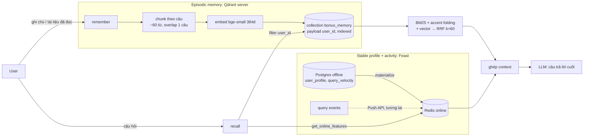

# Hybrid Memory cho trợ lý AI cá nhân tiếng Việt

**Contributors:** Nguyễn Vũ Huy (làm một mình, có dùng Claude Code, xem log cuối file)
**Code:** [`agent.py`](agent.py) · [`demo.py`](demo.py) · chạy trên Docker stack của lab (Qdrant server + Redis + Postgres)

## Sơ đồ kiến trúc

Hai luồng tách biệt và chỉ gặp nhau ở bước ghép context. Qdrant trả lời câu hỏi
*"user đã đọc/ghi gì liên quan?"*. Feast trả lời *"user là ai và gần đây đang
làm gì?"*. LLM nhận cả hai trong một prompt.

## Quyết định 1: Chunking theo nhóm câu (~60 từ, overlap 1 câu)

**Chọn:** gom câu liên tiếp đến khoảng 60 từ, câu cuối của chunk trước được lặp lại ở đầu chunk sau.

**So với các phương án khác:**
- *Per-message*: ghi chú của user thường ngắn và gãy ("HPA cần resource requests").
  Embed riêng từng câu cho vector nghèo ngữ cảnh, recall kém với câu hỏi diễn đạt
  lại. Số điểm cũng tăng gấp 3–5 lần so với cách đang chọn.
- *Per-conversation*: một hội thoại dài trộn nhiều chủ đề, nên vector bị "trung bình hoá"
  và chẳng giống chủ đề nào. Mỗi hit còn kéo theo hàng nghìn token vào context window.
- *Semantic break* (cắt khi embedding đổi hướng): chất lượng tốt nhất nhưng phải
  embed từng câu hai lần, và rất khó debug.

**Tradeoff:** ~60 từ (~80–100 token tiếng Việt) giữ đủ ngữ cảnh để vector có nghĩa.
Top-3 chunk chỉ tốn ~300 token context. Overlap 1 câu tốn thêm ~15–20% dung lượng
lưu trữ, đổi lại không mất ý nằm ngay chỗ cắt. Ở quy mô một người dùng (vài nghìn
chunk), chi phí lưu trữ không đáng kể so với chất lượng retrieval.

## Quyết định 2: Feature schema dạng tabular, có TTL theo tốc độ thay đổi

| Feature | Entity | TTL | Nguồn |
|---|---|---|---|
| `topic_affinity`, `preferred_language`, `reading_speed_wpm` | user | 30 ngày | batch hằng ngày (Postgres) |
| `queries_last_hour`, `distinct_topics_24h` | user | 1 giờ | streaming (Push API) |

**Chọn tabular, không chọn embedding feature** (vector "sở thích ẩn" học từ lịch sử). Lý do:
1. **Giải thích được.** Context gửi LLM ghi "User likes 'cloud'", một câu LLM và
   con người đều đọc được. Một vector 384 chiều không đưa vào prompt được, phải
   dùng gián tiếp để re-rank.
2. **Đúng thời điểm (PIT).** Feature tabular đi qua `get_historical_features`, nên
   khi train re-ranker không bị rò dữ liệu tương lai (NB4/NB8 đo được lift ảo +0.12
   AUC nếu join sai). Embedding feature cần pipeline versioning riêng.
3. **TTL có nghĩa nghiệp vụ.** Nếu `queries_last_hour` để TTL 30 ngày, trợ lý sẽ nói
   "bạn đang hỏi nhiều về cloud" khi user đã chuyển chủ đề từ tuần trước.

Cái giá phải trả: tabular bỏ lỡ sở thích tinh tế (thích *bài dài về kiến trúc*, ghét *tutorial*).
Đó là bước tiếp theo, thêm vào như một retriever thứ ba trong RRF, không thay thế.

## Quyết định 3: Freshness theo use case, không một con số cho tất cả

| Use case | Độ tươi | Cơ chế | Vì sao |
|---|---|---|---|
| "Tôi đang quan tâm gì gần đây?" | **< 1 giây** | Push API → Redis | user vừa hỏi xong mà trợ lý không biết thì trông "ngớ ngẩn" |
| Tài liệu vừa đọc xong → recall được | **~5 phút** | micro-batch embed + upsert | embed tốn CPU; gom batch rẻ hơn nhiều mà user hiếm khi hỏi lại trong 5 phút |
| Profile (`topic_affinity`, tốc độ đọc) | **hằng ngày** | batch + `materialize-incremental` | thay đổi chậm; refresh nhanh hơn chỉ tốn tiền và tạo nhiễu |

POC: `remember()` upsert ngay (đồng bộ). Phần "recent" là `deque` trong process,
đóng vai Push API. Feast profile là batch materialize từ Postgres.

## Phương án đã loại

**Đã xem xét lưu episodic memory trong Feast** (embedding feature view, online store
Redis) để chỉ phải vận hành một hệ thống. **Đã loại** vì:
- Feast online store là **key-value lookup theo entity**, không có ANN search. Muốn
  tìm "memory giống câu hỏi" thì phải kéo hết về rồi tự tính cosine.
- Chu kỳ ghi khác hẳn: memory mới đến **mỗi vài phút**, profile đổi **hằng tuần**.
  Gộp chung buộc profile chạy theo nhịp materialize của memory.
- Cần filter theo payload (`user_id`, ngày, loại tài liệu) ngay trong ANN. NB5 cho
  thấy post-filter sập recall từ 1.00 xuống 0.00 ở độ chọn lọc 3.8%. Qdrant có
  filtered-ANN, Feast thì không.

Cũng đã loại **một collection riêng cho mỗi user**: cách ly mạnh hơn nhưng hàng
nghìn collection nhỏ rất tốn overhead. Chọn một collection có payload index
`user_id` cộng filter bắt buộc trong mọi query. `demo.py` có kiểm tra: u_001 không
thấy memory của u_002 dù truy vấn đúng nội dung đó.

## Bối cảnh tiếng Việt

- **Gõ không dấu:** user hay viết "deploy app len k8s bang helm". BM25 tokenize cả
  dạng gốc lẫn dạng bỏ dấu (`fold_accents`), nên "tự động" và "tu dong" khớp nhau.
- **Code-switching vi/en** ("summary cloud security", "rollback nếu probe fail"):
  tách theo khoảng trắng giữ nguyên thuật ngữ tiếng Anh làm token. pyvi/underthesea
  tách từ ghép tiếng Việt tốt hơn ("cơ sở dữ liệu" thành 1 token), nhưng chậm hơn,
  thêm dependency, và đôi khi tách sai thuật ngữ tiếng Anh. Với memory cá nhân ngắn,
  whitespace + accent folding là điểm cân bằng tốt. Vector sẽ bù phần ngữ nghĩa.
- **Embedding:** bge-small (tiếng Anh) yếu với paraphrase tiếng Việt. NB2 đo được
  semantic chỉ 24% trên slice paraphrase. Production nên dùng bge-m3 (cần GPU để
  giữ latency). POC giữ bge-small vì máy chỉ có CPU.
- **Nghị định 13/2023 về bảo vệ dữ liệu cá nhân:** memory là dữ liệu cá nhân, nên
  `forget_user()` xoá toàn bộ điểm của một user theo filter (quyền xoá dữ liệu).
  Dữ liệu nên lưu ở region trong nước hoặc có đánh giá chuyển dữ liệu ra nước ngoài.

## POC này chưa xử lý

- **Đồng nghĩa/viết tắt:** hỏi "Kubernetes" không kéo được ghi chú viết "k8s" (thấy rõ ở Q1 trong demo). Cần từ điển alias hoặc embedding đa ngữ tốt hơn.
- **Re-rank theo profile:** `topic_affinity` mới chỉ được đưa vào context, chưa thành retriever thứ ba trong RRF.
- **BM25 dựng lại mỗi lần recall** (scroll toàn bộ memory của user): ổn với vài nghìn chunk, không ổn với vài trăm nghìn.
- Chưa có mã hoá at-rest theo từng user, sửa/xoá từng memory riêng lẻ, đồng bộ nhiều thiết bị, hay cơ chế quên/gộp memory theo thời gian.
- Push API tới Feast chưa nối thật. Phần "recent" chỉ tồn tại trong process.

## Vibe-coding log

Làm cùng Claude Code. **Prompt hiệu quả nhất:** đưa đúng signature `remember()/recall()`
và yêu cầu *"dùng lại `Embedder` và công thức RRF của `app/search.py`, filter `user_id`
trong mọi query"*. Kết quả gần như đúng ngay từ đầu vì bám pattern có sẵn.
**Prompt thất bại:** "viết phần phân tích vì sao filter làm giảm recall" khi chưa đưa
dữ liệu. AI bịa ra một ví dụ nghe hợp lý nhưng sai (mq_000 thật ra được đoán đúng
topic). Phải kiểm tra lại planner trên 12 câu hỏi thật mới ra nguyên nhân đúng.
Bài học: AI viết boilerplate tốt, nhưng mọi nhận định về dữ liệu phải tự đo.
